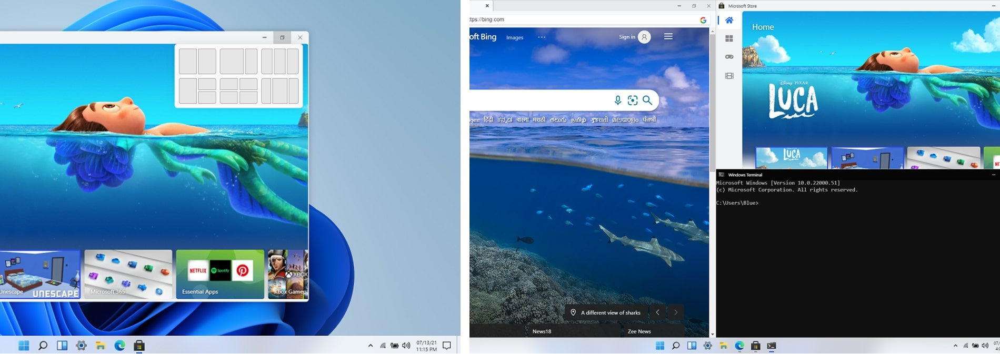

# Win11React_CN

win11c是一个开源项目，旨在使用 React、CSS 和 JavaScript 等标准 Web 技术在 Web 上复制 Windows 11 的桌面体验。欢迎你也参与到这个优秀项目的本土化工作当中！

## 申明

> 此项目绝不附属于微软，且不应与微软操作系统或产品混淆。
> 本项目仅仅是在网页端对 Win11 的桌面外观进行复刻。本项目并不是一个真正的操作系统
> 这并不是云主机/服务器/Windows 365 cloud PC。

>
> **该项目仍在进行中**
>
> 

#### 现场体验: [win11c.vercel.app](https://win11c.vercel.app)

# 展示

-----------------------

- [x] 开始菜单、搜索菜单和小部件
- [x] 桌面和右键单击操作
- [x] 侧边导航和日历视图
- [x] 不同布局中的贴靠窗口
- [x] 浏览器， 商店， 终端， 计算器
- [x] 记事本、Vscode、白板
- [x] 文件资源管理器 + 设置
- [x] 拖动窗口和调整窗口大小
- [x] 启动和锁定屏幕
- [x] 主题和背景
- [x] 多语言支持

<!--- ## FAQ

- 这是完整的操作系统吗？
  - 不，这不是一个完整的操作系统，无论如何它也不隶属于微软。
- 花了多长时间？
  - 老实说，收集资产需要 2-3 天，规划需要 2-3 天，编程时间约为 6 天。
- 您是否使用过任何 UI/库？
  - 并没有。
- 我可以做贡献吗？
  - 是的，你可以！打开议题、创建拉取请求、前往讨论或加入Discord。
- 如果有的话，你从哪里得到灵感？
  - 我从[这个YouTube视频](https://www.youtube.com/watch?v=OtOmxa9UMe8)中得到了灵感。 ----->

## 在线部署

我非常推荐使用**Vercel**进行在线部署，就像演示网站那样。对于中国用户来说，他的访问速度是极快的，在某种意义上这是完全免费的。

[]

## 许可证

⚖️ MIT License